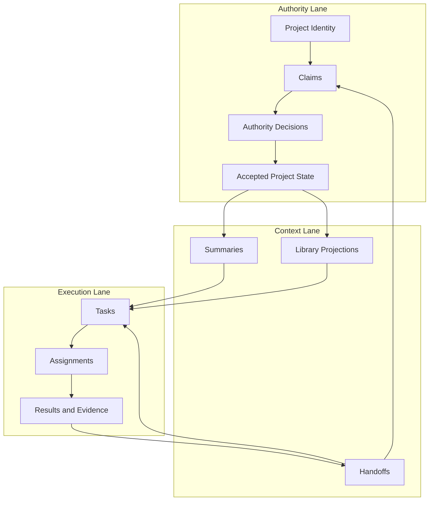

# Workbench Architecture

## Purpose

Workbench governs the continuity of a long-lived project while its participants change. A participant can be a human, an AI model, an agent runtime, or a tool. The project remains the durable subject.

## Boundary

Workbench does not replace:

- agent runtimes or model providers;
- Git and implementation history;
- IDEs and code execution environments;
- knowledge bases; or
- project-management systems.

It complements them by governing project identity, decision provenance, accepted state, and recovery context.

## Information Lanes

### Authority Lane

The Authority Lane defines project reality. Claims propose changes. An Authority Decision accepts, rejects, or defers each claim. The Accepted Project State is derived from accepted decisions rather than treated as mutable agent memory.

### Context Lane

The Context Lane makes a project legible to the next participant. Handoffs, summaries, and library projections are derived artifacts: useful for orientation, but never more authoritative than their source decisions.

### Execution Lane

The Execution Lane records what participants were asked to do and what they returned. It supports routing and traceability but does not allow an execution result to bypass governance.

## Continuity Protocol

1. A participant receives the smallest sufficient combination of accepted project context and relevant Handoff material.
2. It performs work and returns a result, evidence, or proposed change.
3. The proposal enters as a Claim.
4. Authority accepts, rejects, or defers the Claim.
5. Accepted decisions update project state and refresh authoritative projections.
6. A Handoff carries execution continuity; together with relevant Accepted State, it lets the next participant resume without rebuilding the entire project history.

## Design Invariants

- No Claim becomes accepted project state without an Authority Decision.
- Context artifacts cite or derive from their authoritative sources.
- Accepted state can be traced through decisions to originating claims.
- A new participant can be substituted without changing the project's identity or decision history.
- Reversals happen through recorded supersession, not silent mutation.

## Maturity Boundary

The architecture is public now. Its claims are deliberately narrower than a product claim: the current implementation demonstrates an architectural kernel; usability, long-term continuity gains, token savings, and heterogeneous agent routing require public evidence and continued validation.
