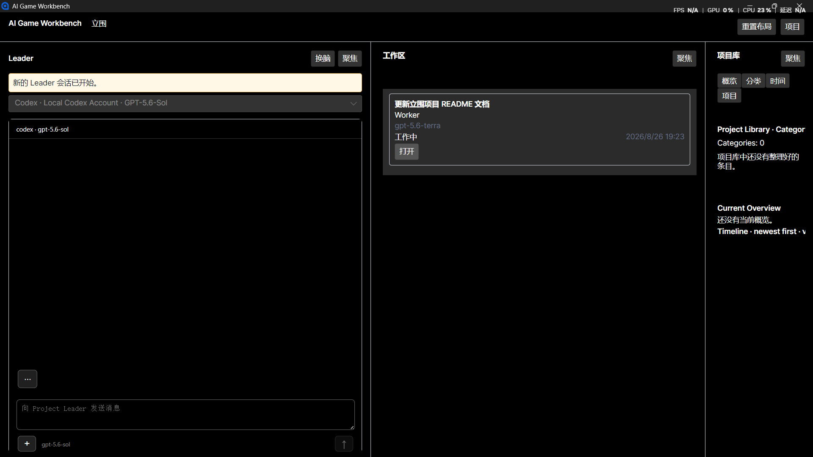
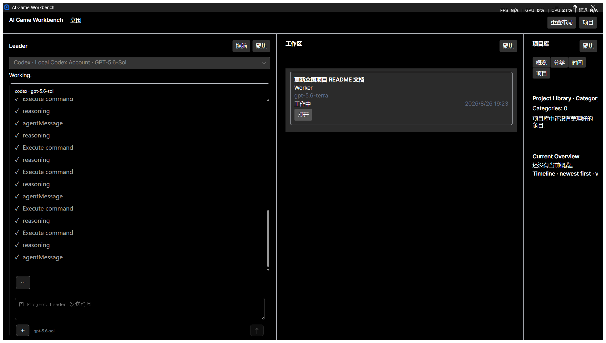
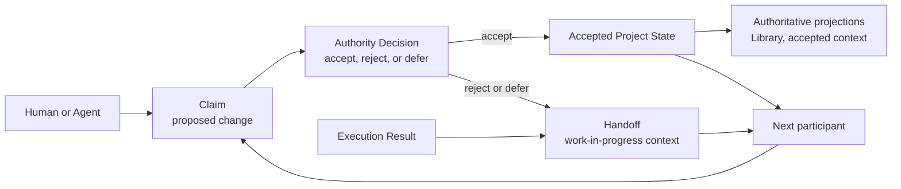

# Workbench

> A project continuity layer for long-term AI collaboration.

**Architecture Preview -- August 27, 2026.**

Workbench is an open architecture experiment for projects that outlive the AI agents, models, sessions, and tools that work on them. It is not another agent runtime, IDE, knowledge base, or project-management system. It is the layer that preserves what a project is, what it has decided, why those decisions were made, and how a new participant can continue responsibly.

This repository is the public Architecture Preview. A Windows-first `v0.1.0-alpha.20260827` candidate already exists in the implementation workspace, but the binary is not being treated as a stable product release. The current work is focused on making the first broadly shared software experience worthy of that release.

The Markdown whitepapers are the canonical versions for this Preview. Word exports are retained under [`drafts/`](./drafts/) for later regeneration and visual QA; they are not release artifacts.

## Current Implementation Glimpse

These screenshots document the current Windows-first reference implementation. They are evidence of the present interface state, not a claim that the Alpha user experience is finished.

## Implementation Snapshot

**Implemented**

- Project-first persistent state.
- Claim → Decision → Accepted State governance.
- Authority / Context / Execution separation.
- Handoff and restart recovery.
- Agent participation adapters and bounded routing.
- Evidence provenance records.
- Local WEIQI³ cross-Agent acceptance experiment.
- **1,022 / 1,022** tests passed in the 2026-08-27 local working-tree snapshot.

**In progress**

- Agent Surface UX and broader interaction polish.
- Broader provider validation.
- Public continuity and token-efficiency experiments.

**Not claimed**

- Large-scale user validation.
- Proven token or time savings.
- Multi-user governance.
- Production-ready enterprise platform.

## The Problem

An agent can complete a task and still leave a project less coherent than it found it. Conversation history retains exploration, but not necessarily commitment. Git records implementation changes, but not the decision rationale behind them. Knowledge bases preserve information, but do not determine what the project currently accepts as true.

Workbench addresses the missing continuity layer between those tools.

## Core Model

The governing invariant is simple: an output from a human or an agent is a proposal until an authority decision accepts it into project state.

Workbench separates information into three lanes:

| Lane | Purpose |
| --- | --- |
| Authority | Governs accepted project reality and decision provenance. |
| Context | Supplies orientation through Handoffs, summaries, and read-only projections. |
| Execution | Records the work performed by people, agents, and tools. |

## Read

- [Whitepaper, English](./workbench_paper_en.md)
- [Whitepaper, Chinese](./workbench_paper_cn.md)
- [Theoretical foundations, English](./THEORETICAL_FOUNDATIONS.md)
- [理论基础（中文）](./理论基础.md)
- [Why Workbench, Chinese](./%E6%88%91%E4%BB%AC%E4%B8%BA%E4%BB%80%E4%B9%88%E8%A6%81%E5%81%9A%20Workbench.md)
- [Architecture at a glance](./ARCHITECTURE.md)
- [Roadmap and release status](./ROADMAP.md)
- [Validation evidence and reproducibility boundary](./VALIDATION.md)

## Current Status

The paper reports a working architectural kernel with governance primitives, accepted-state projection, provenance and recovery, local persistence, Agent participation, and a basic interaction slice. The implementation workspace also contains a local WEIQI³ cross-Agent acceptance record and Windows package. The limits remain important: the cross-Agent evidence is local rather than a broad public study; there are no user studies, no longitudinal continuity results, no quantified token savings, and no claim of production readiness.

This repository is therefore a place to read, inspect, challenge, and discuss the architecture. It is not a promise that the current UI or experimental code is a finished product.

## Principles

- The project must not belong to one agent, model, session, or vendor.
- Proposed changes must not silently become project truth.
- Context should be compressible without erasing the authority behind it.
- New participants must be able to recover the project world without replaying every past conversation.
- Workbench should complement Git, existing agents, and existing tools rather than replace them.
- Core project state should remain local and inspectable.

## Contributing to the Architecture

The most useful early feedback is concrete: counterexamples, missing invariants, alternative governance models, integration boundaries, and reproducible continuity experiments. Please use GitHub Issues for specific defects or proposals, and GitHub Discussions for broader design questions.

## License

This project is released under the [MIT License](./LICENSE).
