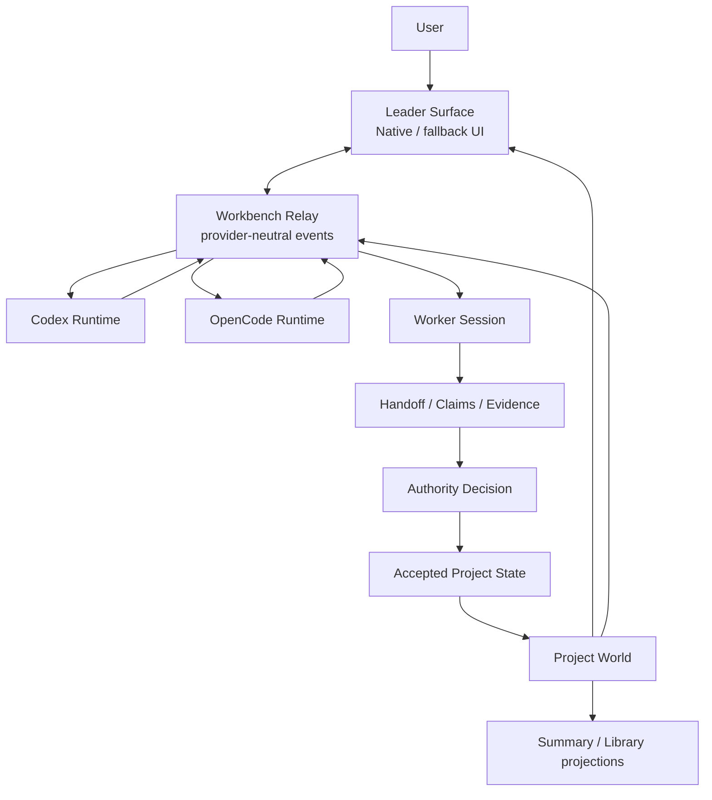

# Workbench Alpha Architecture

Status: **Release-facing architecture summary**  
Version: `v0.1.0-alpha.20260827`  
Recorded: **2026-08-27**

## Core Boundary

Workbench owns the durable Project World. Agents provide replaceable execution and interaction. The Agent surface is a projection, not the owner of identity, authority, or continuity.



## Ownership Rules

| Concern | Owner | Boundary |
|---|---|---|
| Project identity and accepted facts | Workbench Project World | Rebuilt from persisted authority history |
| Agent/session/model identity | Runtime adapter + Workbench binding | Never becomes Project authority |
| Streaming, tool activity, approval, stop, steer | Relay and Agent Surface | Structured events; UI may be recreated |
| Assignment and Attempt | Continuity layer | Bounded work contract and execution history |
| Claim and Handoff | Continuity layer | Non-authoritative returned work |
| Accepted state mutation | Authority Decision | No direct Agent or UI write path |
| Summary and Library | Rebuildable projections | Navigation and compression, not truth |

## Recovery Path

```text
Persisted Project World
  -> Assignment / Attempt / SessionBinding
  -> Claims and Handoff
  -> explicit Authority Decision
  -> Accepted Project State
  -> new Agent or new Session
```

The Leader Surface can restart or be replaced without deleting the Assignment, Attempt, transcript projection, approval correlation, or session identity held by the host.

## Alpha Scope

The Alpha proves the continuity spine and a usable Leader surface. It does not claim to be a complete IDE, universal Agent client, or governance platform. See [known limitations](../alpha-known-limitations.md).
